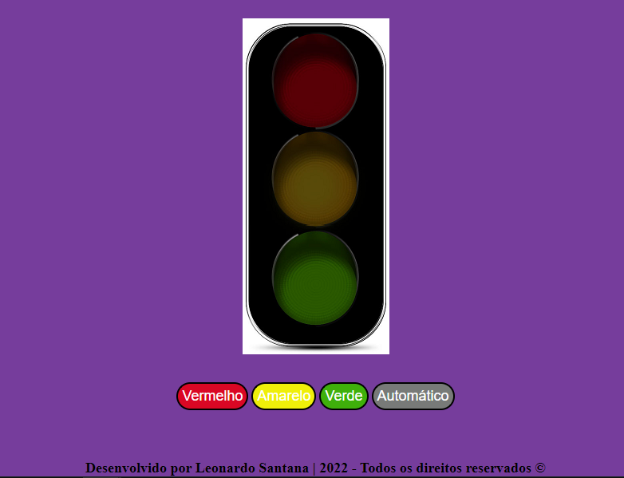
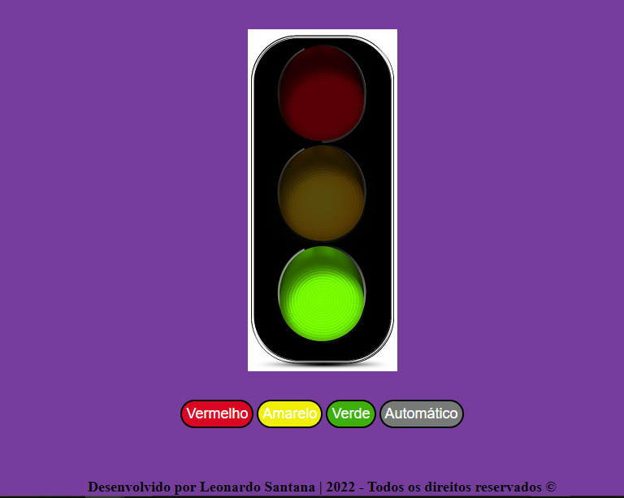
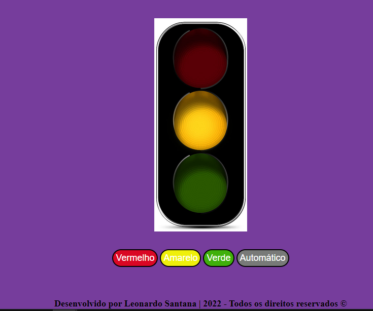
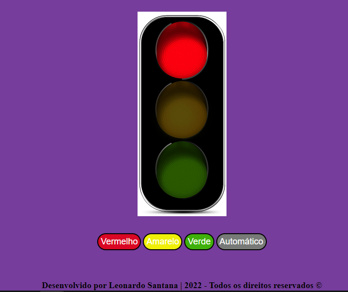

# Sobre o projeto:

Projeto de um semáfaro desenvolvido em HTML5, CSS3 e JavaScript, onde o objetivo é mostrar o semáfaro funcionando, ou seja, acendendo as luzes em verde, amarelo e vermelho. Também é mostrado para deixar o semáfaro funcionando de forma automática. Durante o desenvolvimento desse projeto, a parte técnica do CSS e da linguagem JavaScript foi colocado em prática, na parte do CSS foi aprendido a parte do CSS Flexbox, um conceito muito importante para posicionar os elementos do CSS. Na parte do JavaScript, foi aprendido como pegar os elementos do HTML com a DOM, e foi usado também funções anônimas para fazer o semáfaro ligar as luzes e colocar no automático. Também foi usado evento de click para o usuário que clicar na cor desejada, aparecer essa cor para o usuário. 

# Tecnologias utilizadas:

- HTML5,
- CSS3 e 
- JavaScript;

# Layout do projeto:

## Semáfaro desligado:

## Semáfaro com a luz verde acesa:

## Semáfaro com a luz amarela acesa:

## Semáfaro com a luz vermelha acesa:

# Link do projeto desenvolvido:

- https://lsantana95.github.io/Semafaro/

# Autor:

Onde me encontrar?

- Entrar em contato comigo:

https://lsantana95.github.io/RocketLinks/ 
